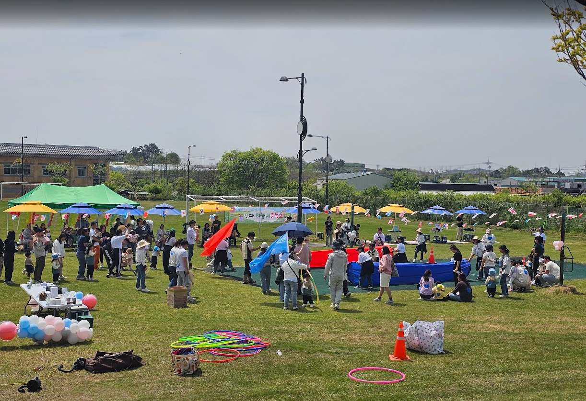
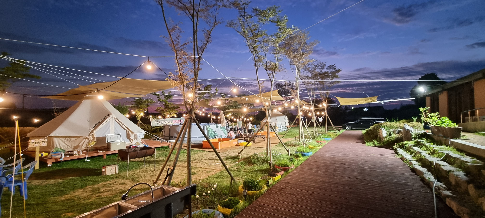

<html lang="ko">
<head>
    <meta charset="UTF-8">
    <meta name="viewport" content="width=device-width, initial-scale=1.0">
    <title>2026 에코왕곡 교육 프로그램 제안서</title>
    
    
</head>
<body class="antialiased scroll-smooth text-left">

    <!-- Navigation -->
    <nav class="sticky top-0 z-50 bg-white/95 backdrop-blur-md border-b border-stone-200 shadow-sm h-16 flex items-center">
        

            

                🌱
                <h1 class="font-black text-xl text-stone-900 tracking-tighter">에코왕곡교육센터</h1>
            

            

                <button onclick="scrollToId('strengths')" class="text-stone-600 hover:text-lime-700 font-bold text-sm transition-soft">기관강점</button>
                <button onclick="scrollToId('annual')" class="text-stone-600 hover:text-lime-700 font-bold text-sm transition-soft">연간계획</button>
                <button onclick="scrollToId('wood-project')" class="text-orange-600 hover:text-orange-700 font-black text-sm transition-soft">시그니처목공</button>
                <button onclick="scrollToId('schedule')" class="text-stone-600 hover:text-lime-700 font-bold text-sm transition-soft">일정표</button>
                <button onclick="showModal()" class="bg-lime-900 text-white px-6 py-2 rounded-full font-black text-sm hover:bg-black shadow-md">상담 신청</button>
            

        

    </nav>

    <!-- Hero Section -->
    <section class="relative h-[85vh] flex items-center justify-center overflow-hidden bg-stone-900 text-center text-white text-balance">
        

            
        

        

            
🏆 전국 으뜸촌 & 2025 스타마을 선정 기관

            <h1 class="text-5xl md:text-8xl font-black mb-8 leading-tight tracking-tighter italic">자연이 아이들의   선생님이 됩니다</h1>
            
누리과정 연계 프리미엄 생태·환경교육  10년 이상의 독보적 노하우로 완성된 명품 수업

            

                <button onclick="scrollToId('annual')" class="px-10 py-4 bg-lime-600 text-white font-black rounded-2xl shadow-xl hover:bg-lime-700 transition-soft transform hover:-translate-y-1">2026 연간 계획 보기</button>
                <button onclick="showModal()" class="px-10 py-4 bg-white/10 backdrop-blur-md border border-white/30 text-white font-black rounded-2xl hover:bg-white/20 transition-soft">상담 및 예약 신청</button>
            

        

    </section>

    <main class="max-w-7xl mx-auto px-4 sm:px-6 lg:px-8 py-20 space-y-32">

        <!-- 1. 기관 강점 -->
        <section id="strengths" class="animate-in text-center text-center">
            

                <h2 class="text-base text-lime-600 font-black tracking-widest uppercase mb-4 text-center">History & Quality</h2>
                
에코왕곡교육센터 10년의 신뢰

                
대한민국 농촌 교육의 표준을 제시합니다. 10년간 수많은 교육 기관의 선택을 받아온 전문성을 약속합니다.

            

            

                

                    
🏅

                    <h3 class="font-black text-xl text-stone-900 mb-4 tracking-tight font-black text-lime-800 text-center">국가인증 1등급 기관</h3>
                    
농식품부 '으뜸촌' 및 교육부 인증기관. 국가가 보증하는 안전과 품질을 약속합니다.

                

                

                    
📚

                    <h3 class="font-black text-xl text-stone-900 mb-4 tracking-tight font-black text-lime-800 text-center">누리과정 밀착 설계</h3>
                    
월별 생활주제와 아이들의 발달 단계에 최적화된 [체험+놀이+이야기] 커리큘럼을 제공합니다.

                

                

                    
👨‍🏫

                    <h3 class="font-black text-xl text-stone-900 mb-4 tracking-tight font-black text-lime-800 text-center">전문 강사 직접 지도</h3>
                    
자격증을 보유한 목공 전문 강사진이 교실로 찾아갑니다. 아이들의 안전과 성장을 책임집니다.

                

            

        </section>

        <!-- 2. 연간 계획 -->
        <section id="annual">
            

                <h2 class="text-base text-lime-600 font-black tracking-widest uppercase mb-4 text-left">Educational Roadmap</h2>
                
2026학년도 연간 교육 계획

                

                    <button onclick="updateFilter('all')" id="f-all" class="px-5 py-2 rounded-xl text-xs font-black transition-soft bg-white shadow-sm text-lime-800">전체</button>
                    <button onclick="updateFilter('spring')" id="f-spring" class="px-5 py-2 rounded-xl transition-soft text-stone-500 hover:bg-white/50 font-bold">봄</button>
                    <button onclick="updateFilter('summer')" id="f-summer" class="px-5 py-2 rounded-xl transition-soft text-stone-500 hover:bg-white/50 font-bold">여름</button>
                    <button onclick="updateFilter('autumn')" id="f-autumn" class="px-5 py-2 rounded-xl transition-soft text-stone-500 hover:bg-white/50 font-bold">가을</button>
                    <button onclick="updateFilter('winter')" id="f-winter" class="px-5 py-2 rounded-xl transition-soft text-stone-500 hover:bg-white/50 font-bold">겨울</button>
                

                
※ 본 이미지는 예시이며, 실제 활동 및 완성품은 교육 여건에 따라 변경될 수 있습니다.

            

            

        </section>

        <!-- 3. 시그니처 목공 -->
        <section id="wood-project" class="bg-stone-900 rounded-[80px] p-12 md:p-24 overflow-hidden relative">
            

            

                Premium Woodcraft Project
                <h2 class="text-4xl md:text-5xl font-black text-white mb-6 tracking-tighter italic font-serif text-center text-center">"나무와 친해지기 3.0"</h2>
                
"10년 이상 현장에서 검증된 국내 유일의 3차시 연속성 목공 프로젝트입니다."

                
※ 목공 완성품은 연령 및 원의 상황에 따라 디자인이 세련되게 변경될 수 있습니다.

                

                    

                        

                            1차
                            
                            
<h3 class="text-white text-2xl font-black text-left">도구의 발견</h3>

                        

                        

                            <h4 class="text-[11px] font-black text-orange-400 uppercase tracking-widest mb-3 text-left">Discovery</h4>
                            
나무와 나무못을 자유롭게 두드리며 성질을 익히고 정서적 해소감을 얻는 기초 단계입니다.

                            
* 동물 못박기 세트 1인 1개 제공

                        

                    

                    

                        

                            2차
                            
                            
<h3 class="text-white text-2xl font-black text-left text-left text-left">기술의 완성</h3>

                        

                        

                            <h4 class="text-[11px] font-black text-orange-400 uppercase tracking-widest mb-3 text-left">Structure</h4>
                            

                                자동차
                                새싹화분
                                캐릭터연필꽂이
                            

                            
1차 지식을 바탕으로 드라이버와 망치를 활용해 실제 기능을 가진 작품을 완성합니다.

                        

                    

                    

                        

                            3차
                            
                            
<h3 class="text-white text-2xl font-black text-left text-left text-left text-left">이야기의 확장</h3>

                        

                        

                            <h4 class="text-[11px] font-black text-orange-400 uppercase tracking-widest mb-3 text-left">Storytelling</h4>
                            
나만의 마을을 구성하고 목공 인형을 통해 따뜻한 이야기를 완성하는 하이라이트 단계입니다.

                        

                    

                

                

                    

                        <h4 class="text-3xl font-black text-white mb-6 font-serif italic text-left">준비물 걱정 없는 '출장 안심' 시스템</h4>
                        <ul class="grid sm:grid-cols-2 gap-4 text-orange-50 font-bold text-sm text-left">
                            <li class="flex items-center gap-2">✅ 재료 세팅부터 뒷정리까지 완벽 책임</li>
                            <li class="flex items-center gap-2 text-left">✅ 전문 목공 강사 직접 지도 (자격 보유)</li>
                            <li class="flex items-center gap-2 text-left text-left">✅ 연령별 발달 단계 맞춤형 교구 제공</li>
                            <li class="flex items-center gap-2 text-left text-left">✅ 저소음 작업 패드 사용 (층간소음 방지)</li>
                        </ul>
                    

                    <button onclick="showModal()" class="bg-white text-orange-600 px-14 py-7 rounded-3xl font-black text-xl shadow-2xl hover:bg-orange-50 transition transform hover:scale-105 active:scale-95 text-center font-black uppercase">상담 신청하기</button>
                

            

        </section>

        <!-- 4. 특별 행사 및 일정표 -->
        <section id="schedule" class="animate-in text-center text-center text-center">
            

                <h2 class="text-base text-orange-600 font-black tracking-widest uppercase mb-4 text-center">Seasonal Special</h2>
                
함께 웃고 추억하는 특별 행사

                
에코왕곡의 특별 행사는 단순한 대관이 아닙니다. 대표님의 직접 진행과 10년의 노하우가 결합된 '올인원 패키지'입니다.

            

            
            

                

                    

                        
                        
<h3 class="text-white text-3xl font-black drop-shadow-md text-center text-center text-center">🚩 명랑 운동회</h3>

                    

                    

                        <ul class="space-y-4 text-stone-600 font-bold text-left text-left">
                            <li class="flex gap-3 text-left">✅ 대표님 직접 진행 (MC비 무료 혜택)</li>
                            <li class="flex gap-3 text-left text-left">✅ 대형 천연 잔디 마당 원 단독 사용</li>
                            <li class="flex gap-3 text-left text-left text-left text-left">✅ 음향 장비 및 행사 물품 일체 지원</li>
                        </ul>
                        <button onclick="switchSchedule('sports'); scrollToId('sched-view');" class="w-full py-4 bg-lime-600 text-white font-black rounded-2xl transition hover:bg-lime-700 text-center font-black uppercase shadow-lg text-center text-center">운동회 일정표 보기</button>
                    

                

                

                    

                        
                        
<h3 class="text-white text-3xl font-black drop-shadow-md text-center text-center text-center text-center text-center">⛺ 졸업 여행</h3>

                    

                    

                        <ul class="space-y-4 text-stone-600 font-bold text-left text-left">
                            <li class="flex gap-3 text-left text-left">✅ 1박 2일 따뜻한 온돌 숙박 보장</li>
                            <li class="flex gap-3 text-left text-left">✅ LED 불멍 & 촛불의식 무료 진행</li>
                            <li class="flex gap-3 text-left text-left text-left text-left">✅ 저녁(BBQ)+아침+점심 3식 풀패키지</li>
                        </ul>
                        <button onclick="switchSchedule('grad'); scrollToId('sched-view');" class="w-full py-4 bg-orange-600 text-white font-black rounded-2xl transition hover:bg-orange-700 text-center font-black uppercase shadow-lg text-center text-center">졸업여행 일정표 보기</button>
                    

                

            

            <!-- 타임라인 일정표 -->
            

                

                    <button onclick="switchSchedule('basic')" id="s-btn-basic" class="schedule-tab-active px-8 py-3 rounded-full text-sm font-black transition-soft text-center font-black">일반 체험</button>
                    <button onclick="switchSchedule('sports')" id="s-btn-sports" class="bg-stone-100 text-stone-500 px-8 py-3 rounded-full text-sm font-black hover:bg-stone-200 transition-soft font-bold text-center">명랑 운동회</button>
                    <button onclick="switchSchedule('grad')" id="s-btn-grad" class="bg-stone-100 text-stone-500 px-8 py-3 rounded-full text-sm font-black hover:bg-stone-200 transition-soft font-bold text-center">졸업 여행</button>
                

                

                    

                

            

        </section>

        <!-- 5. 견적 계산기 (오각형 삭제 및 중앙 배치) -->
        <section id="calculator" class="pt-32 border-t border-stone-200 text-center text-center text-center">
            

                

                    Nuri-Curriculum Alignment 98%
                    <h2 class="text-4xl font-black text-stone-900 leading-tight tracking-tighter text-center">스마트 맞춤 견적 산출</h2>
                    
누리과정 5대 영역을 골고루 담은 에코왕곡의 교육 가치입니다.

                

                

                    

                        
Estimator<h2 class="text-3xl font-black mt-3 text-stone-800 tracking-tighter text-left">견적 미리보기</h2>

                        

0원

VAT Not Included

                    

                    

                        

                            <label class="block text-[11px] font-black text-stone-400 mb-4 tracking-widest uppercase text-left">Attendance Count</label>
                            <input type="number" id="in-child" value="25" class="w-full px-8 py-5 rounded-[32px] border-2 border-stone-50 bg-stone-50 focus:bg-white focus:border-lime-500 outline-none text-4xl font-black transition-soft text-left font-black" />
                        

                        

                            

                                나주 로컬 점심 식단
                                친환경 건강 식단 (1인 8,000원 추가)
                            

                            <input type="checkbox" id="in-meal" class="w-12 h-12 text-lime-600 rounded-3xl focus:ring-lime-500 cursor-pointer accent-lime-600 shadow-sm text-left" />
                        

                        <button onclick="showModal()" class="w-full py-7 bg-stone-900 text-white font-black rounded-[40px] hover:bg-black transition transform hover:scale-105 shadow-2xl text-2xl tracking-tight uppercase text-center font-black font-black">상담 신청 및 예약하기</button>
                    

                

            

        </section>
    </main>

    <!-- Footer -->
    <footer class="bg-stone-900 text-stone-500 py-24 border-t border-white/5 text-center font-bold text-center text-center">
        

            <h2 class="text-4xl font-black text-white mb-10 tracking-tighter uppercase tracking-[0.2em] text-center">에코왕곡교육센터</h2>
            

                 전국 으뜸촌 지정
                 전남 2025 스타마을
                 교육부 인증기관
            

            
전라남도 나주시 왕곡면 나주서부로 371-14 | 061-335-8101

            
📞 사무장 박선율 010-8680-8101

            
Copyright © 2026 Eco Wanggok. All rights reserved.

        

    </footer>

    <!-- 상담 신청 모달 -->
    

        

            
📬

            <h2 class="text-3xl font-black text-lime-800 mb-2 font-black tracking-tight text-center">상담 및 예약 신청</h2>
            
10년의 신뢰로 정성껏 안내해 드립니다.

            

                
👤

상담 담당자

박선율 사무장

                
📞

직통 번호

010-8680-8101

            

            

                <button onclick="window.location.href='tel:01086808101'" class="w-full py-5 bg-lime-600 text-white rounded-2xl font-black text-lg shadow-lg hover:bg-lime-700 transition font-black">사무장님께 전화 걸기</button>
                <button onclick="window.location.href='sms:01086808101?body=[에코왕곡] 제안서 보고 연락드렸습니다. 원명 및 인원:'" class="w-full py-5 bg-stone-800 text-white rounded-2xl font-black text-lg shadow-lg hover:bg-stone-900 transition font-black">문의 문자 남기기</button>
                <button onclick="closeModal()" class="w-full py-4 text-stone-400 font-bold text-center font-black">창 닫기</button>
            

        

    

    
</body>
</html>
